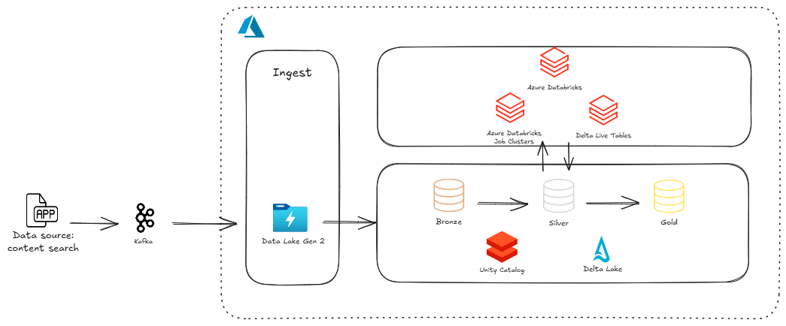

# Kafka Data Pipeline with Azure Blob Storage

## Overview
This project demonstrates a simple data pipeline that uses Kafka to stream data and Azure Blob Storage to store it in Parquet format. Additionally, Databricks Delta Live Tables (DLT) is used to implement a Medallion Architecture for processing and transforming data in streaming.

## Components
- **Producer**: Simulates user searches for grocery items, generates random search data, and sends it to a Kafka topic.
- **Consumer**: Consumes messages from the Kafka topic, batches them, and uploads them as Parquet files to Azure Blob Storage.
- **Kafka**: Acts as a message broker, enabling asynchronous communication between the producer and consumer.
- **Azure Blob Storage**: Provides scalable and cost-effective storage for the Parquet files.
- **Databricks Delta Live Tables (DLT)**: Implements a Medallion Architecture for data processing and supports real-time streaming ingestion and transformations.



## Data Flow
### Producer
Generates random search data, including:
- `id`: A unique identifier for the search.
- `content_search`: The grocery item searched for.
- `lat`: Latitude coordinate of the search.
- `long`: Longitude coordinate of the search.

Sends the data as JSON messages to a Kafka topic.

### Kafka
- Receives messages from the producer and stores them in the specified topic.
- Distributes messages to consumers in a fault-tolerant manner.

### Consumer
- Subscribes to the Kafka topic and consumes messages.
- Batches messages based on size and time interval.
- Converts batches of messages into Parquet format.
- Uploads Parquet files to Azure Blob Storage.

## Delta Live Tables (DLT) - Medallion Architecture and Streaming
DLT is used to implement a Medallion Architecture, which processes data in three layers: Bronze, Silver, and Gold. It also supports real-time streaming, enabling continuous data ingestion and transformation.

### Implementation
#### Bronze Layer (Streaming Ingestion)
```python
import dlt
from pyspark.sql.functions import count, col

@dlt.table(
    spark_conf={"pipelines.trigger.interval" : "10 seconds"},
    name="bronze_content_search",
    table_properties={
        "quality": "bronze"
    }
)
def bronze_content_search():
    return spark.readStream.format("parquet").load("abfss://rawdata@testdataeng.dfs.core.windows.net/search_content_data/")
```

#### Silver Layer (Data Cleansing)
```python
@dlt.table(
    spark_conf={"pipelines.trigger.interval" : "10 seconds"},
    name="silver_content_search",
    table_properties={
        "quality": "silver"
    }
)
def silver_content_search():
    bronze_df = dlt.read_stream("bronze_content_search")
    return bronze_df.distinct().filter(col("content_search") != "Chá")
```

#### Gold Layer (Aggregations)
```python
@dlt.table(
    spark_conf={"pipelines.trigger.interval" : "10 seconds"},
    name="gold_content_search",
    table_properties={
        "quality": "gold"
    }
)
def gold_content_search():
    silver_df = dlt.read_stream("silver_content_search")
    return silver_df.groupBy("id").agg(count("content_search").alias("total_search"))
```


## Requirements
- Docker
- Python 3.9
- Confluent Kafka
- Azure Blob Storage account

### Required Python Packages
- `confluent-kafka`
- `pyarrow`
- `azure-identity`
- `azure-storage-blob`
- `faker`
- `python-dotenv`

## Setup
### Environment Variables
Create a `.env` file in both the producer and consumer directories. Add the following environment variables:
```env
BOOTSTRAP_SERVERS=your_kafka_bootstrap_servers
SASL_USERNAME=your_kafka_username
SASL_PASSWORD=your_kafka_password
TOPIC=your_kafka_topic
TENANT_ID=your_azure_tenant_id
CLIENT_ID=your_azure_client_id
CLIENT_SECRET=your_azure_client_secret
```

### Docker Compose
Run the following command to start the producer and consumer services:
```sh
docker-compose up -d
```

## Scaling
- **Producer**: Scale horizontally by increasing the number of replicas in the `docker-compose.yml` file.
- **Consumer**: Scale horizontally by running multiple instances of the consumer service. Kafka will distribute messages among the consumers in the consumer group.

## Monitoring
- Use tools like Kafkacat or Confluent Control Center to monitor the Kafka topic.
- Monitor the Azure Blob Storage account using the Azure portal.
- Use Databricks' built-in monitoring for streaming queries and DLT pipelines.

## Future Improvements
- Implement schema registry for data validation and evolution.
- Add error handling and retry mechanisms.
- Implement data quality checks and alerts.
- Use a more robust batching mechanism with windowing.
- Explore using Kafka Streams for more complex data processing.
- Optimize streaming configurations in DLT for higher throughput.

**Note**: This is a basic example and can be further extended to handle more complex scenarios and data processing requirements.

